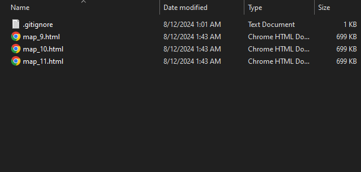
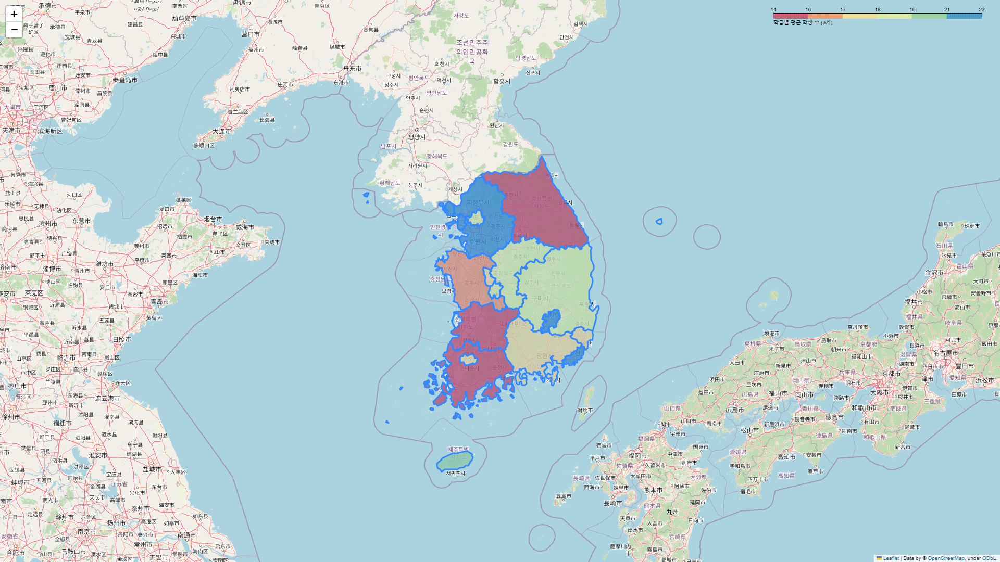
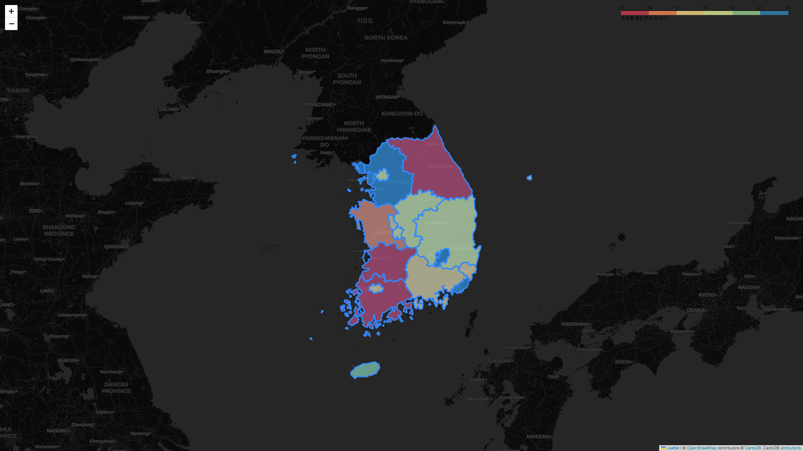
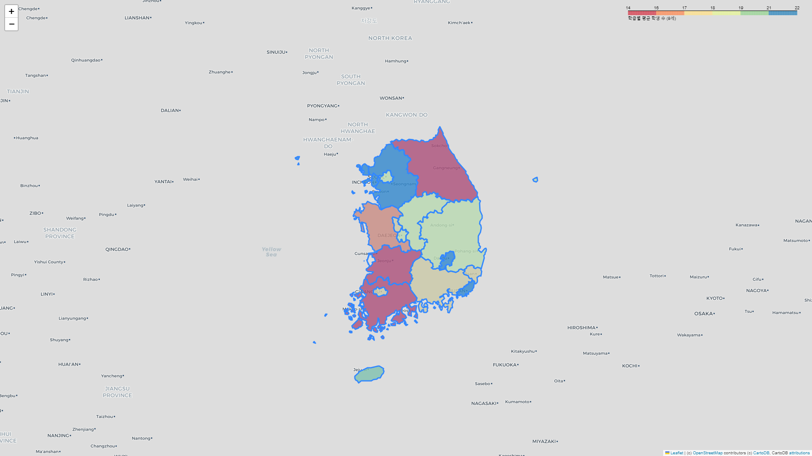
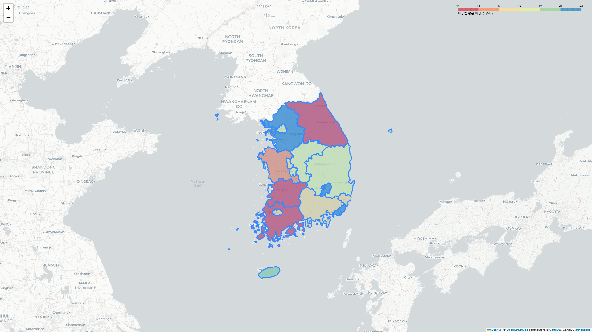
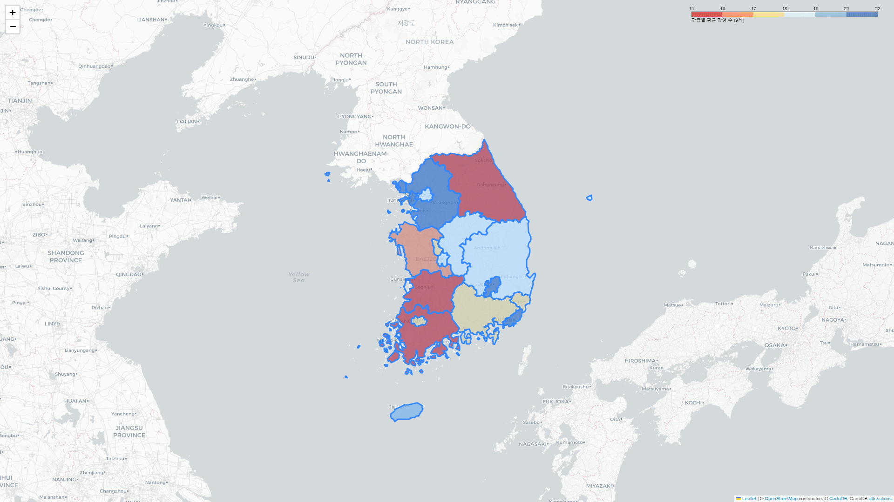
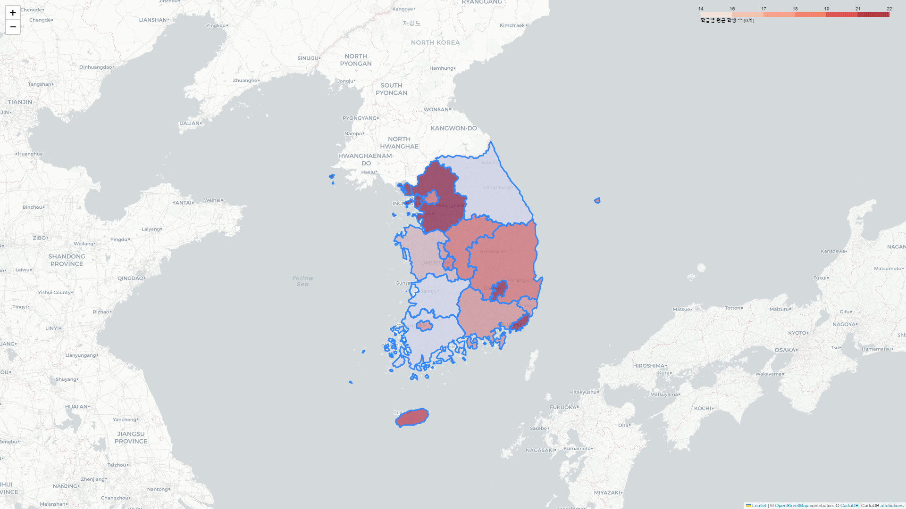
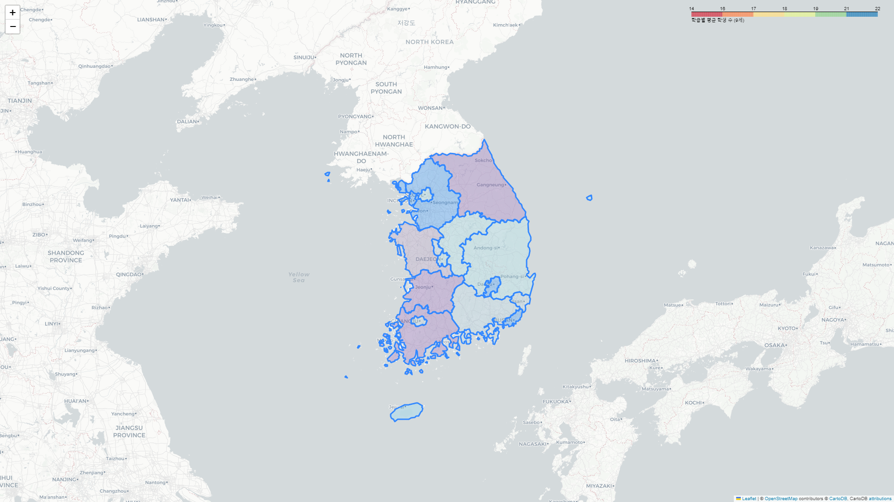
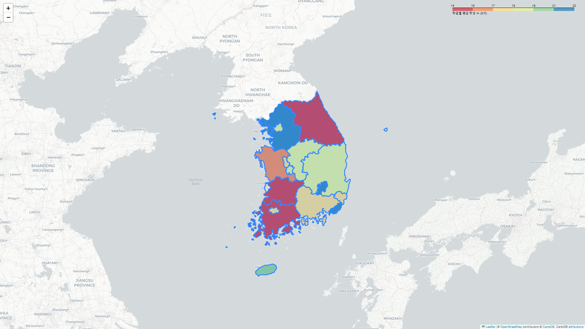

# Config 가이드

## 개요
```config/config.yml```을 활용하여 시각화 옵션을 손쉽게 변경할 수 있도록 구현하였습니다.

## 참고
옵션의 자료형과 기본값은 ```config/config.yml```에 명시되어있습니다.

## Config 사용 방법
* ```config/config.yml```의 옵션을 원하는대로 변경하고 저장해줍니다.
* ```config/config.yml```이 정상적으로 설정되었을 경우, ```main.py``` 스크립트 실행 시 설정된 옵션이 자동으로 적용됩니다.

## Config 설정 항목
### ages_to_visualize
* ages_to_visualize를 통해 시각화할 나이를 선택할 수 있습니다.

##### 예시 1
<pre><code>ages_to_visualize:
  - 9
  - 10
  - 11
  - 12
  - 13
  - 14
  - 15
  - 16
  - 17
  - 18
  - 19</code></pre>

##### 결과 1


##### 예시 2
<pre><code>ages_to_visualize:
  - 9
  - 10
  - 11</code></pre>

##### 결과 2


### map_style
* map_style을 통해 시각화할 지도의 디자인을 설정할 수 있습니다.
* 더욱 많은 map_style 옵션은 [여기](https://m.blog.naver.com/rackhunson/222401467790)를 참고해주세요.

##### 예시 1
<pre><code>map_style: 'cartodbpositron'</code></pre>

##### 결과 1


##### 예시 2
<pre><code>map_style: 'openstreetmap'</code></pre>

##### 결과 2


##### 예시 3
<pre><code>map_style: 'cartodbdark_matter'</code></pre>

##### 결과 3


##### 예시 4
<pre><code>map_style: 'cartodbpositrononlylabels'</code></pre>

##### 결과 4


### fill_color
* fill_color를 통해 시각화 색상을 설정할 수 있습니다.
* 더욱 많은 fill_color 옵션은 [여기](https://user-images.githubusercontent.com/17128994/115975254-c2031e00-a56b-11eb-8025-d82d36bfda1d.png)를 참고해주세요.

##### 예시 1
<pre><code>fill_color: 'Spectral'</code></pre>

##### 결과 1


##### 예시 2
<pre><code>fill_color: 'RdYlBu'</code></pre>

##### 결과 2


##### 예시 3
<pre><code>fill_color: 'Reds'</code></pre>

##### 결과 3


### fill_opacity
* fill_opacity를 통해 시각화 투명도를 설정할 수 있습니다.

##### 예시 1
<pre><code>fill_opacity: 0.25</code></pre>

##### 결과 1


##### 예시 2
<pre><code>fill_opacity: 0.75</code></pre>

##### 결과 2


##### 예시 3
<pre><code>fill_opacity: 1.0</code></pre>

##### 결과 3

